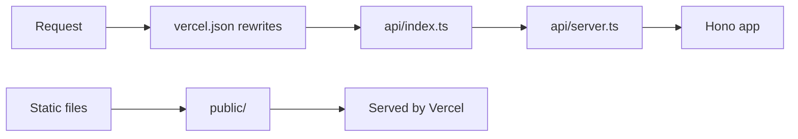
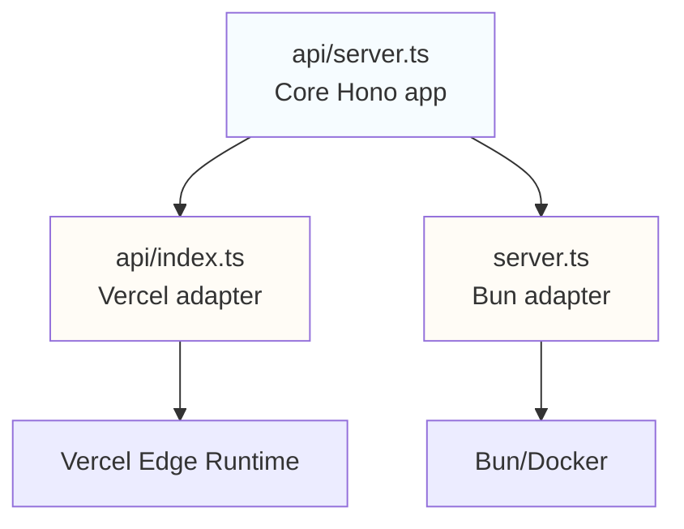

# Deployment

Getting this thing running locally or in production.

## Local Development

The dev server uses Bun, and it will serve the Hono API along with static files from `/public`.
You can also use the Vercel CLI, with `yarn dev:vercel`, to test the edge function behaviour locally.

```bash
yarn install
yarn dev
```

---

## Production - Vercel

This is where we're currently deployed. Push to `main` and it auto-deploys, or run `yarn deploy`

> [!TIP]
> First time? `npm install -g vercel && vercel login`

**How it works:**



The [`vercel.json`](https://github.com/Lissy93/readme-contribs/blob/main/vercel.json) config handles routing requests to the edge function and serving static files from `/public`.

---

## Production - Docker

#### Pre-built Image

```bash
docker run -p 8080:8080 -e GITHUB_TOKEN=your_token ghcr.io/lissy93/readme-contribs:latest
```

Or, download the [`docker-compose.yml`](https://github.com/Lissy93/readme-contribs/blob/main/docker-compose.yml) and run `docker-compose up`

#### Manual Docker

You can build manually with:

```bash
# Build the image
docker build -t readme-contribs .

# Run the container
docker run -d \
  -p 8080:8080 \
  -e GITHUB_TOKEN=your_token \
  --name readme-contribs \
  readme-contribs

# Check logs
docker logs -f readme-contribs
```

Commands:
- Build - `docker build -t readme-contribs .`
- Run - `docker run -d -p 8080:8080 --name readme-contribs readme-contribs`
- Stop - `docker stop readme-contribs && docker rm readme-contribs`
- Logs - `docker logs -f readme-contribs`
- Start - `docker-compose up -d`
- Stop - `docker-compose down`

## Environment Variables

| Variable | Purpose | Required |
|----------|---------|----------|
| `PORT` | Server port | No (defaults to 8080) |
| `GITHUB_TOKEN` | Higher rate limits + sponsors access | No (but you'll want it) |

Without a GitHub token, you'll hit rate limits quickly and can't fetch sponsor data. Get one from [GitHub settings](https://github.com/settings/tokens).

## Architecture

The app uses the adapter pattern to run on different platforms without code duplication:



- **[`api/server.ts`](https://github.com/Lissy93/readme-contribs/blob/main/api/server.ts)** - The actual application (all routes and logic)
- **[`api/index.ts`](https://github.com/Lissy93/readme-contribs/blob/main/api/index.ts)** - Vercel wrapper (just imports and exports)
- **[`server.ts`](https://github.com/Lissy93/readme-contribs/blob/main/server.ts)** - Bun wrapper (adds port config)

This means we write the routes once and they work everywhere. Lovely.

## Scripts Reference

See [`package.json`](https://github.com/Lissy93/readme-contribs/blob/main/package.json) for the full list, but the important ones:

```bash
# Development
yarn dev              # Bun dev server
yarn dev:vercel       # Vercel dev server

# Deployment
yarn deploy           # Ship it to Vercel

# Testing & Quality
yarn test             # Run the test suite
yarn quality          # Lint + format checks
yarn quality:fix      # Fix all the things
```

