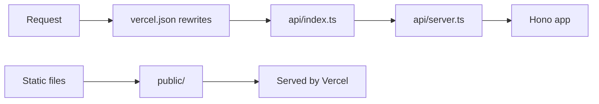
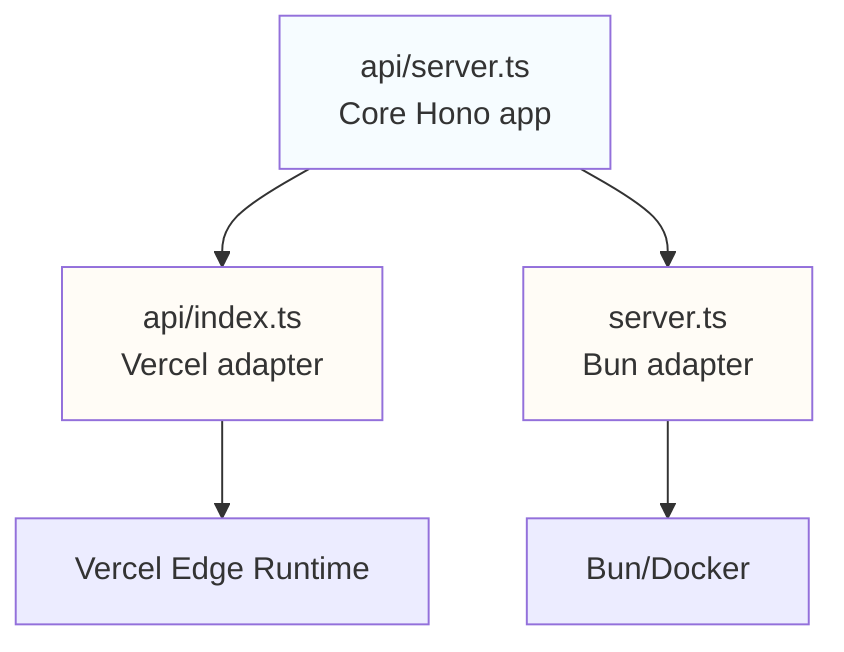

# Deployment

Getting this thing running locally or in production.

## Local Development

### Bun (recommended)

```bash
yarn install
yarn dev
```

Opens on `http://localhost:8080` and serves the full web interface from `/public`.

### Vercel CLI

If you want to test the edge function behaviour locally:

```bash
yarn dev:vercel
```

## Production

### Vercel

This is where we're currently deployed. Push to `main` and it auto-deploys, or:

```bash
yarn deploy
```

> [!TIP]
> First time? `npm install -g vercel && vercel login`

**How it works:**



The [`vercel.json`](https://github.com/Lissy93/readme-contribs/blob/main/vercel.json) config handles routing requests to the edge function and serving static files from `/public`.

### Docker

For self-hosting or if you just want full control:

```dockerfile
FROM oven/bun:1
WORKDIR /app
COPY package.json yarn.lock ./
RUN bun install --frozen-lockfile
COPY . .
EXPOSE 8080
CMD ["bun", "run", "start"]
```

```bash
docker build -t readme-contribs .
docker run -p 8080:8080 -e GITHUB_TOKEN=your_token readme-contribs
```

> [!NOTE]
> The Docker setup uses [`server.ts`](https://github.com/Lissy93/readme-contribs/blob/main/server.ts) which is a tiny Bun wrapper around the core app. Same code as Vercel, different runtime.

## Environment Variables

| Variable | Purpose | Required |
|----------|---------|----------|
| `PORT` | Server port | No (defaults to 8080) |
| `GITHUB_TOKEN` | Higher rate limits + sponsors access | No (but you'll want it) |

Without a GitHub token, you'll hit rate limits quickly and can't fetch sponsor data. Get one from [GitHub settings](https://github.com/settings/tokens).

## Architecture

The app uses the adapter pattern to run on different platforms without code duplication:



- **[`api/server.ts`](https://github.com/Lissy93/readme-contribs/blob/main/api/server.ts)** - The actual application (all routes and logic)
- **[`api/index.ts`](https://github.com/Lissy93/readme-contribs/blob/main/api/index.ts)** - Vercel wrapper (just imports and exports)
- **[`server.ts`](https://github.com/Lissy93/readme-contribs/blob/main/server.ts)** - Bun wrapper (adds port config)

This means we write the routes once and they work everywhere. Lovely.

## Scripts Reference

See [`package.json`](https://github.com/Lissy93/readme-contribs/blob/main/package.json) for the full list, but the important ones:

```bash
yarn dev              # Bun dev server
yarn dev:vercel       # Vercel dev server
yarn deploy           # Ship it to Vercel
yarn test             # Run the test suite
yarn quality          # Lint + format checks
yarn quality:fix      # Fix all the things
```

