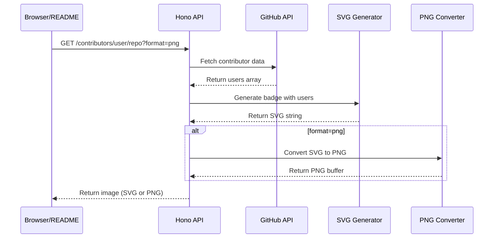
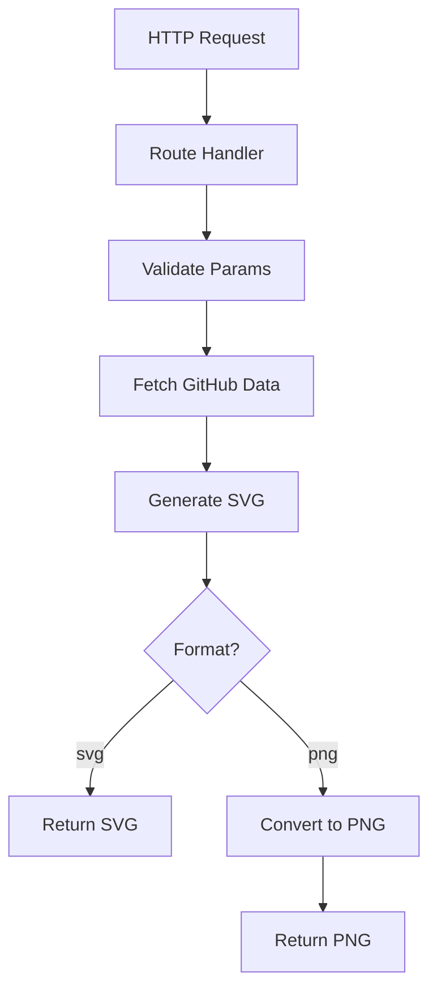

# How It Works

This is a simple badge generation API that creates embeddable contributor/sponsor/stargazer widgets for GitHub READMEs.

## Request Flow



## Architecture



## Key Components

### 1. Route Handlers (`api/lib/route-handlers.ts`)
Generic handler factory that:
- Validates path params (owner, repo)
- Parses query options with Zod
- Calls the appropriate data fetcher
- Generates and returns the image

### 2. Data Fetchers (`api/github/*.ts`)
Each endpoint has a fetcher:
- `getContributors()` - repo contributors
- `getSponsors()` - user sponsors (via GraphQL)
- `getStargazers()` - repo stargazers
- `getWatchers()` - repo watchers/subscribers
- `getForkers()` - repo forkers
- `getFollowers()` - user followers

All normalize data to `User[]` format.

### 3. SVG Generator (`api/svg-output.ts`)
Takes user array + options, outputs SVG:
- Calculates grid layout
- Renders avatar images (as `<image>` tags or base64)
- Adds labels, title, footer
- Handles responsive/dynamic modes

### 4. Image Output (`api/utilities.ts`)
- `returnImage()` - handles both SVG and PNG formats
- `convertSvgToPng()` - uses @resvg/resvg-js for conversion
- Sets proper Content-Type and cache headers

## Configuration

All badge options are defined once in `api/config/params.js`:
- Frontend uses it for UI generation
- Backend uses it for Zod schema validation
- OpenAPI spec syncs with it

## Deployment

Runs on Vercel as serverless functions (Node.js runtime, not Edge). The API is stateless - no database, no sessions, just pure HTTP request/response.

## Caching

Responses include cache headers:
```
Cache-Control: public, max-age=3600, s-maxage=7200, stale-while-revalidate=86400
```

This means:
- Browser caches for 1 hour
- CDN caches for 2 hours
- Stale content can be served for 24 hours while revalidating
